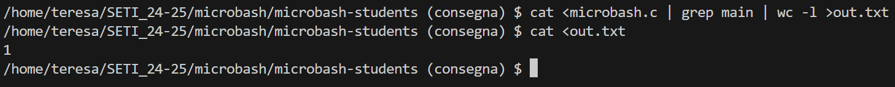
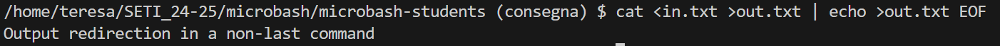
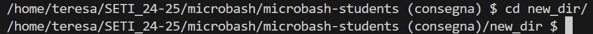
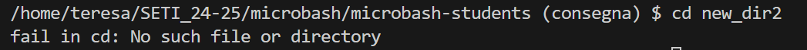
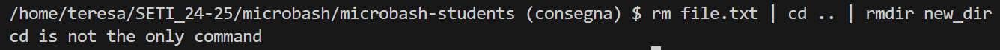
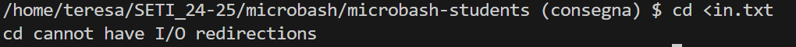
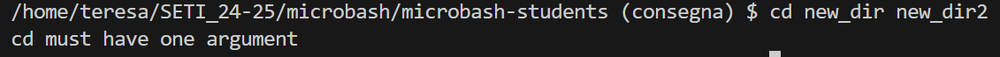

# RELAZIONE LABORATORIO MICROBASH

### Partecipanti
- Teresa de Jesus Fernandes, 4190022
- Elisa Gotelli, 5666586

## TESTING
### TEST 1: (line 477) funzionamento getcwd()

```c
int main()
{
	...
	for(;;) {
		char *pwd;
		/* Make pwd point to a string containing the current working directory.
		 * The memory area must be allocated (directly or indirectly) via malloc.
		 */
		/*** TO BE DONE START ***/

		pwd = getcwd(NULL, 0);
        ...
        }
    ...
}
```

**scopo:** verificare il funzionamento della funzione getcwd

**situazione iniziale:** -

**linea inviata a microbash:** - (*si verifica tramite l'esecuzione del programma*)

**risultato atteso:** stampa del prompt della microbash con indicata la cartella di lavoro corrente

**risultato ottenuto:**


**note:** -


### TEST 2: (line 185) verifica della capacità di espandere le variabili di ambiente in parse_cmd()

```c
command_t *parse_cmd(char * const cmdstr) 
{
	...
			if (*tmp=='$') { 

				/* Make tmp point to the value of the corresponding environment variable, if any, or the empty string otherwise */
				/*** TO BE DONE START ***/

				if (!tmp[1]) {
					fprintf(stderr, "Parsing error: no variable name specified\n");
					goto fail;
				}
				if (!(tmp = getenv(tmp + 1))) 
					tmp = "";

				/*** TO BE DONE END ***/
			}
			
			...
}
```

**scopo:** verificare che la microbash espanda le variabili d’ambiente esistenti, indicate con il simbolo “$” seguito subito dopo dal nome della variabile (senza spazi tra i due elementi)

**situazione iniziale:** la variabile di ambiente HOME è definita nell'ambito della microbash

**linea inviata a microbash:** echo $HOME

**risultato atteso:** stampa del valore della variabile di ambiente HOME

**risultato ottenuto:**


**note:** questi risultati si ottengono solo con variabili di ambiente predefinite, in quanto non è possibile definirne di nuove tramite la microbash


### TEST 3: (line 185) verifica della capacità di espandere variabili di ambiente non esistenti in parse_cmd()

```c
command_t *parse_cmd(char * const cmdstr) 
{
	...
			if (*tmp=='$') { 

				/* Make tmp point to the value of the corresponding environment variable, if any, or the empty string otherwise */
				/*** TO BE DONE START ***/

				if (!tmp[1]) {
					fprintf(stderr, "Parsing error: no variable name specified\n");
					goto fail;
				}
				if (!(tmp = getenv(tmp + 1))) 
					tmp = "";

				/*** TO BE DONE END ***/
			}
			
			...
}
```

**scopo:** verificare che la microbash “espanda” le variabili d’ambiente non esistenti, sostituendole con una stringa vuota nella linea di comando

**situazione iniziale:** la variabile di ambiente X non è definita

**linea inviata a microbash:** echo $X

**risultato atteso:** stampa della stringa vuota

**risultato ottenuto:**


**note:** -


### TEST 4: (line 185) verifica della capacità di stampare errore quando si fornisce $ ma non viene poi specificato il nome della variabile desiderata (spazio vuoto o fine della linea di comando) in parse_cmd()

```c
command_t *parse_cmd(char * const cmdstr) 
{
	...
			if (*tmp=='$') { 

				/* Make tmp point to the value of the corresponding environment variable, if any, or the empty string otherwise */
				/*** TO BE DONE START ***/

				if (!tmp[1]) {
					fprintf(stderr, "Parsing error: no variable name specified\n");
					goto fail;
				}
				if (!(tmp = getenv(tmp + 1))) 
					tmp = "";

				/*** TO BE DONE END ***/
			}
			
			...
}
```

**scopo:** : verificare che la microbash stampi un errore se il simbolo $ non è seguito dal nome di una variabile (spazio vuoto o fine della linea di comando)

**situazione iniziale:** -

**linea inviata a microbash:** echo $

**risultato atteso:** Parsing error: no variable name specified

**risultato ottenuto:**


**note:** -


### TEST 5: (line 244) verifica delle redirezioni in I/O nella riga di comando

```c
check_t check_redirections(const line_t * const l)
{
	assert(l);
	
	/* This function must check that:
	 * - Only the first command of a line can have input-redirection
	 * - Only the last command of a line can have output-redirection
	 * and return CHECK_OK if everything is ok, print a proper error
	 * message and return CHECK_FAILED otherwise
	 */
	/*** TO BE DONE START ***/
	
	if (l -> n_commands != 1)
		for (int i = 0; i < l -> n_commands; ++i) {
			if (i != 0)
				if (l -> commands[i] -> in_pathname) {
					fprintf(stderr, "Input redirection in a non-first command\n"); 
					return CHECK_FAILED; }
			if (i != l -> n_commands - 1)
				if (l -> commands[i] -> out_pathname) {
					fprintf(stderr, "Output redirection in a non-last command\n");
					return CHECK_FAILED;
				}
		}

	/*** TO BE DONE END ***/
	return CHECK_OK;
}
```

**scopo:** verificare la correttezza delle redirezioni in I/O in una linea di comando

**situazione iniziale:** il file *microbash.c* esiste, mentre il file *out.txt* può esistere (in tal caso, viene sovrascritto) o meno (in questo caso, viene creato un file con tale nome)

**linea inviata a microbash:** cat <microbash.c | grep main | wc -l >out.txt

**risultato atteso:** non c'è stampa di alcun errore (e il file out.txt conterrà il numero di volte in cui la stringa *"main"* comparrà nel codice sorgente)

**risultato ottenuto:** 


**note:** -


### TEST 6: (line 249) verifica della segnalazione di un errore nel caso in cui in una linea di comando sono specificate redirezioni errate

```c
check_t check_redirections(const line_t * const l)
{
	assert(l);
	
	/* This function must check that:
	 * - Only the first command of a line can have input-redirection
	 * - Only the last command of a line can have output-redirection
	 * and return CHECK_OK if everything is ok, print a proper error
	 * message and return CHECK_FAILED otherwise
	 */
	/*** TO BE DONE START ***/
	
	if (l -> n_commands != 1)
		for (int i = 0; i < l -> n_commands; ++i) {
			if (i != 0)
				if (l -> commands[i] -> in_pathname) {
					fprintf(stderr, "Input redirection in a non-first command\n"); 
					return CHECK_FAILED; }
			if (i != l -> n_commands - 1)
				if (l -> commands[i] -> out_pathname) {
					fprintf(stderr, "Output redirection in a non-last command\n");
					return CHECK_FAILED;
				}
		}

	/*** TO BE DONE END ***/
	return CHECK_OK;
}
```

**scopo:** verificare che venga segnalato un errore se le redirezioni I/O fornite non siano corrette

**situazione iniziale:** -

**linea inviata a microbash:** cat <in.txt >out.txt | echo >out.txt EOF

**risultato atteso:** Stampa a terminale dell’errore *"Output redirection in a non-last command"* e interruzione dell’esecuzione della linea di comando

**risultato ottenuto:** 


**note:** Lo stesso comportamento si verifica in caso di redirezioni multiple (non supportate da microbash), ma con l'errore a terminale: *"Input redirection in a non-first command"*


### TEST 7: (line 273) verifica del corretto funzionamento del cambio di directory

```c
check_t check_cd(const line_t * const l)
{
	assert(l);

	/* This function must check that if command "cd" is present in l, then such a command
	 * 1) must be the only command of the line
	 * 2) cannot have I/O redirections
	 * 3) must have only one argument
	 * and return CHECK_OK if everything is ok, print a proper error
	 * message and return CHECK_FAILED otherwise
	 */
	/*** TO BE DONE START ***/

	for (int i = 0; i < l -> n_commands; ++i)
		if (strncmp(l -> commands[i] -> args[0], CD, 2) == 0) { 
			if (l -> n_commands != 1) {
				fprintf(stderr, "cd is not the only command \n");
				return CHECK_FAILED;
			}
			if (l -> commands[0] -> in_pathname || l -> commands[0] -> out_pathname) {
				fprintf(stderr, "cd cannot have I/O redirections\n");
						return CHECK_FAILED;
			}
			if (l -> commands[0] -> n_args != 2) {
				fprintf(stderr, "cd must have one argument\n");
				return CHECK_FAILED;
			}
		}

	/*** TO BE DONE END ***/

	return CHECK_OK;
}
```

**scopo:** verificare che cd (*change current working directory*) funzioni correttamente

**situazione iniziale:** nella directory in cui si trova microbash è presente la directory *"new_dir"*

**linea inviata a microbash:** cd new_dir

**risultato atteso:** aggiornamento della cartella di lavoro corrente con la cartella di lavoro fornita dopo cd nella linea di comando

**risultato ottenuto:** 


**note:** se la cartella fornita a cd è assente, viene stampato a terminale un errore proprio ()


### TEST 8: (line 274) verifica dell'incompatibilità di cd con altri comandi in una stessa riga di comando

```c
check_t check_cd(const line_t * const l)
{
	assert(l);

	/* This function must check that if command "cd" is present in l, then such a command
	 * 1) must be the only command of the line
	 * 2) cannot have I/O redirections
	 * 3) must have only one argument
	 * and return CHECK_OK if everything is ok, print a proper error
	 * message and return CHECK_FAILED otherwise
	 */
	/*** TO BE DONE START ***/

	for (int i = 0; i < l -> n_commands; ++i)
		if (strncmp(l -> commands[i] -> args[0], CD, 2) == 0) { 
			if (l -> n_commands != 1) {
				fprintf(stderr, "cd is not the only command \n");
				return CHECK_FAILED;
			}
...
		}
	}
}
```

**scopo:** verificare che cd è un comando che non può convivere con altri comandi nella medesima riga di comando inviata al terminale

**situazione iniziale:** - 

**linea inviata a microbash:** rm file.txt | cd .. | rmdir dir

**risultato atteso:** viene segnalato un errore (*cd is not the only command*) e non viene eseguita la linea di comando 

**risultato ottenuto:**


**note:** -


### TEST 8: (line 278) verifica dell'incompatibilità del comando cd con redirezioni I/O in un stessa riga di comando

```c
check_t check_cd(const line_t * const l)
{
	assert(l);

	/* This function must check that if command "cd" is present in l, then such a command
	 * 1) must be the only command of the line
	 * 2) cannot have I/O redirections
	 * 3) must have only one argument
	 * and return CHECK_OK if everything is ok, print a proper error
	 * message and return CHECK_FAILED otherwise
	 */
	/*** TO BE DONE START ***/

	for (int i = 0; i < l -> n_commands; ++i)
		if (strncmp(l -> commands[i] -> args[0], CD, 2) == 0) { 
			...
			if (l -> commands[0] -> in_pathname || l -> commands[0] -> out_pathname) {
				fprintf(stderr, "cd cannot have I/O redirections\n");
						return CHECK_FAILED;
			}
...
		}
	}
}
```

**scopo:** verificare che cd non può essere associata ad una redirezione dell'I/O

**situazione iniziale:** - 

**linea inviata a microbash:** cd <in.txt

**risultato atteso:** segnalazione di un errore specifico (*cd cannot have I/O redirections*) per la presenza di redirezione

**risultato ottenuto:**


**note:** -


### TEST 9: (line 278) verifica che il numero di argomenti passati a cd sia diverso da 1

```c
check_t check_cd(const line_t * const l)
{
	assert(l);

	/* This function must check that if command "cd" is present in l, then such a command
	 * 1) must be the only command of the line
	 * 2) cannot have I/O redirections
	 * 3) must have only one argument
	 * and return CHECK_OK if everything is ok, print a proper error
	 * message and return CHECK_FAILED otherwise
	 */
	/*** TO BE DONE START ***/

	for (int i = 0; i < l -> n_commands; ++i)
		if (strncmp(l -> commands[i] -> args[0], CD, 2) == 0) { 
			...
			if (l -> commands[0] -> n_args != 2) {
				fprintf(stderr, "cd must have one argument\n");
				return CHECK_FAILED;
			}
...
		}
	}
}
```

**scopo:** verificare che cd riceva esattamente un argomento

**situazione iniziale:** nella directory corrente sono presenti due sub-directory (new_dir e new_dir2)

**linea inviata a microbash:** cd new_dir new_dir2

**risultato atteso:** stampa a terminale del messaggio di errore *cd must have one argument* e conseguente mancata esecuzione della linea di comando

**risultato ottenuto:**


**note:** questo controllo verifica solo il numero di argomenti passati al comando cd e non la loro qualità (e.g. non verifica se non sono directory) o la loro esistenza (i.e. lo stesso risultato si potrebbe ottenere inviando la linea *cd new_dir absent_dir*, dove la directory absent_dir è inesistente nel contesto corrente)