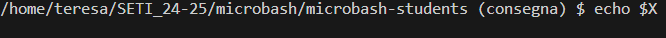
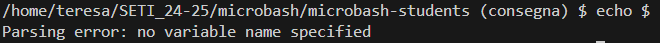

# RELAZIONE LABORATORIO MICROBASH

### Partecipanti
- Teresa de Jesus Fernandes, 4190022
- Elisa Gotelli, 5666586

## TESTING
### TEST 1: (line 477) funzionamento getcwd()

```c
int main()
{
	...
	for(;;) {
		char *pwd;
		/* Make pwd point to a string containing the current working directory.
		 * The memory area must be allocated (directly or indirectly) via malloc.
		 */
		/*** TO BE DONE START ***/

		pwd = getcwd(NULL, 0);
        ...
        }
    ...
}
```

**scopo:** verificare il funzionamento della funzione getcwd

**situazione iniziale:** -

**linea inviata a microbash:** - (*si verifica tramite l'esecuzione del programma*)

**risultato atteso:** stampa del prompt della microbash con indicata la cartella di lavoro corrente

**risultato ottenuto:**


**note:** -


### TEST 2: (line 185) verifica della capacità di espandere le variabili di ambiente in parse_cmd()

```c
command_t *parse_cmd(char * const cmdstr) 
{
	...
			if (*tmp=='$') { 

				/* Make tmp point to the value of the corresponding environment variable, if any, or the empty string otherwise */
				/*** TO BE DONE START ***/

				if (!tmp[1]) {
					fprintf(stderr, "Parsing error: no variable name specified\n");
					goto fail;
				}
				if (!(tmp = getenv(tmp + 1))) 
					tmp = "";

				/*** TO BE DONE END ***/
			}
			
			...
}
```

**scopo:** verificare che la microbash espanda le variabili d’ambiente esistenti, indicate con il simbolo “$” seguito subito dopo dal nome della variabile (senza spazi tra i due elementi)

**situazione iniziale:** la variabile di ambiente HOME è definita nell'ambito della microbash

**linea inviata a microbash:** echo $HOME

**risultato atteso:** stampa del valore della variabile di ambiente HOME

**risultato ottenuto:**


**note:** questi risultati si ottengono solo con variabili di ambiente predefinite, in quanto non è possibile definirne di nuove tramite la microbash


### TEST 3: (line 185) verifica della capacità di espandere variabili di ambiente non esistenti in parse_cmd()

```c
command_t *parse_cmd(char * const cmdstr) 
{
	...
			if (*tmp=='$') { 

				/* Make tmp point to the value of the corresponding environment variable, if any, or the empty string otherwise */
				/*** TO BE DONE START ***/

				if (!tmp[1]) {
					fprintf(stderr, "Parsing error: no variable name specified\n");
					goto fail;
				}
				if (!(tmp = getenv(tmp + 1))) 
					tmp = "";

				/*** TO BE DONE END ***/
			}
			
			...
}
```

**scopo:** verificare che la microbash “espanda” le variabili d’ambiente non esistenti, sostituendole con una stringa vuota nella linea di comando

**situazione iniziale:** la variabile di ambiente X non è definita

**linea inviata a microbash:** echo $X

**risultato atteso:** stampa della stringa vuota

**risultato ottenuto:**


**note:** -


### TEST 4: (line 185) verifica della capacità di stampare errore quando si fornisce $ ma non viene poi specificato il nome della variabile desiderata (spazio vuoto o fine della linea di comando) in parse_cmd()

```c
command_t *parse_cmd(char * const cmdstr) 
{
	...
			if (*tmp=='$') { 

				/* Make tmp point to the value of the corresponding environment variable, if any, or the empty string otherwise */
				/*** TO BE DONE START ***/

				if (!tmp[1]) {
					fprintf(stderr, "Parsing error: no variable name specified\n");
					goto fail;
				}
				if (!(tmp = getenv(tmp + 1))) 
					tmp = "";

				/*** TO BE DONE END ***/
			}
			
			...
}
```

**scopo:** : verificare che la microbash stampi un errore se il simbolo $ non è seguito dal nome di una variabile (spazio vuoto o fine della linea di comando)

**situazione iniziale:** -

**linea inviata a microbash:** echo $

**risultato atteso:** Parsing error: no variable name specified

**risultato ottenuto:**


**note:** -